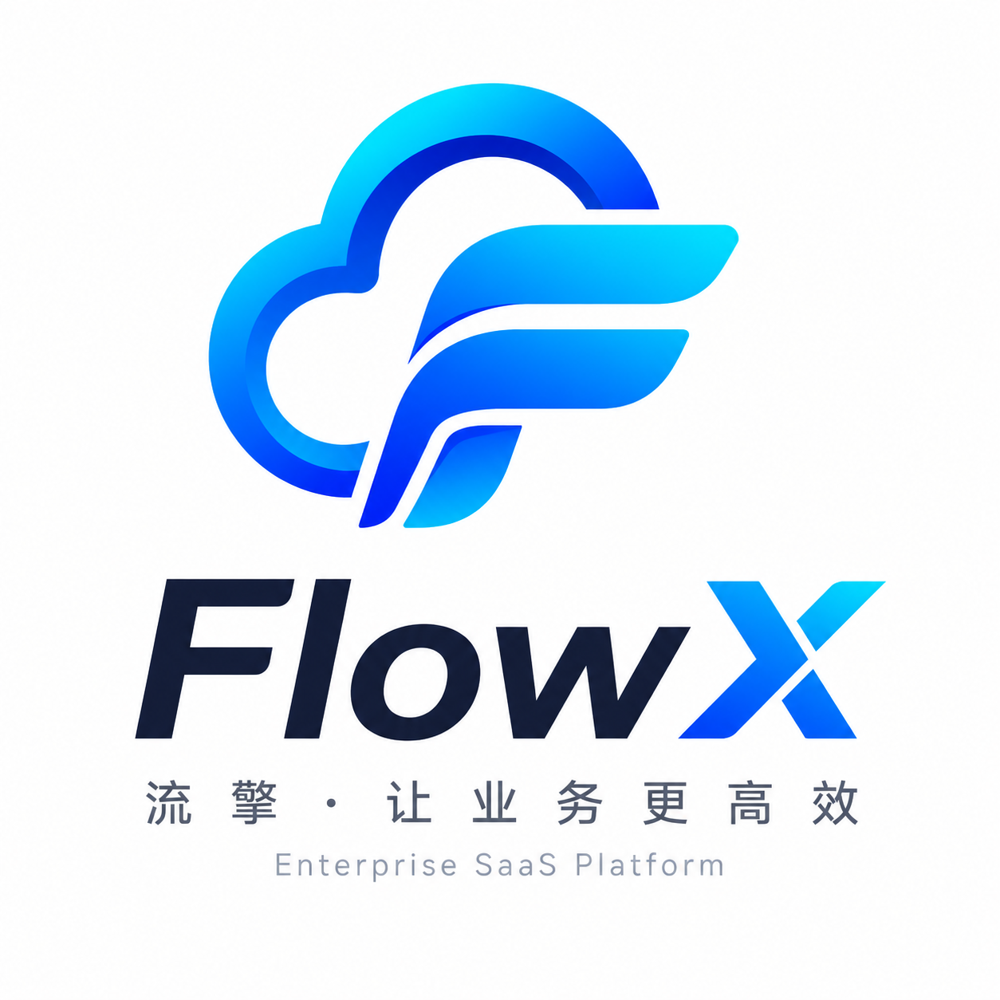

<p align="center">
  
</p>

<h1 align="center">审流云 FlowCloud</h1>

<p align="center">
  <strong>企业级审批流程 SaaS 平台</strong>
</p>

<p align="center">
  <a href="https://github.com"></a>
  <a href="https://github.com"></a>
  <a href="https://github.com"></a>
  <a href="https://github.com"></a>
  <a href="https://github.com"></a>
  <a href="https://github.com"></a>
</p>

<p align="center">让审批像流水一样高效</p>

---

## 目录

- [项目简介](#项目简介)
- [系统架构](#系统架构)
- [技术栈](#技术栈)
- [模块说明](#模块说明)
- [数据库设计](#数据库设计)
- [核心功能](#核心功能)
- [API 文档](#api-文档)
- [快速启动](#快速启动)
- [部署方案](#部署方案)
- [项目规范](#项目规范)
- [扩展规划](#扩展规划)

---

## 项目简介

**审流云（FlowCloud）** 是一套面向中大型企业的审批流程 SaaS 平台，支持多租户数据隔离、RBAC 权限体系、多级审批流程引擎、数据报表与消息通知。采用模块化单体架构，可按业务模块平滑拆分为微服务。

**核心价值：**

- **多租户 SaaS**：企业注册即用，数据严格隔离，支持自定义主题与 Logo
- **灵活审批引擎**：模板化流程配置，支持多级节点、会签、自审等审批模式
- **RBAC 权限体系**：用户-角色-权限三级模型，菜单与按钮级细粒度控制
- **企业级规范**：遵循腾讯 T4 / 阿里 P8 / 字节 2-2 级别代码与架构标准

---

## 系统架构

```
┌──────────────────────────────────────────────────────────────┐
│                     flowcloud-web (React 18)                  │
│            Semi Design + Redux Toolkit + TypeScript           │
└────────────────────────────┬─────────────────────────────────┘
                             │ HTTP / JWT Bearer
┌────────────────────────────▼─────────────────────────────────┐
│                      flowcloud-admin                          │
│          Spring Boot 3.3 + AuthInterceptor + Swagger          │
├────────────┬────────────┬──────────────┬───────────────────────┤
│  system    │  approval  │ notification│  report               │
│ 用户/角色   │ 模板/实例   │  站内消息    │  仪表盘/统计           │
│ 权限/租户   │ 任务/记录   │  通知推送    │  数据导出              │
├────────────┴────────────┴──────────────┴───────────────────────┤
│                      flowcloud-common                          │
│        Result<T> / JwtUtils / TenantContext / BaseEntity       │
│        BusinessException / GlobalExceptionHandler / PageResult │
├───────────────────────────────────────────────────────────────┤
│                      基础设施层                                 │
│   MySQL 8  │  Redis 7  │  RabbitMQ  │  Kafka  │  MinIO  │ Nacos│
└───────────────────────────────────────────────────────────────┘
```

**架构原则：**

| 原则 | 说明 |
|------|------|
| 模块化单体 | 各模块独立 jar，通过 admin 统一启动，后续可拆分微服务 |
| 多租户隔离 | 数据库层 `tenant_id` + MyBatis-Flex 自动注入 + 请求层 JWT 解析 |
| 分层架构 | Controller → Service → Mapper，严格单向依赖 |
| 统一返回 | `Result<T>` 封装，code / message / data 三段式响应 |

---

## 技术栈

### 后端

| 技术 | 版本 | 用途 |
|------|------|------|
| JDK | 21 | 运行时 |
| Spring Boot | 3.3.5 | 应用框架 |
| MyBatis-Flex | 1.9.7 | ORM 框架（多租户、逻辑删除、分页） |
| MySQL | 8.0+ | 关系型数据库 |
| Redis | 7.x | 缓存 / 会话 / 分布式锁 |
| RabbitMQ | 3.x | 消息队列（审批通知） |
| Kafka | Latest | 消息队列（日志/事件流） |
| MinIO | Latest | 对象存储 |
| Nacos | Latest | 配置中心 / 服务注册 |
| JWT (jjwt) | 0.12.6 | 认证令牌 |
| Hutool | 5.8.32 | 工具库 |
| SpringDoc | 2.6.0 | API 文档 |
| EasyExcel | 4.0.3 | 数据导出 |
| Lombok | 1.18.34 | 代码简化 |

### 前端

| 技术 | 版本 | 用途 |
|------|------|------|
| React | 18.3 | UI 框架 |
| TypeScript | 5.6 | 类型安全 |
| Vite | 6.0 | 构建工具 |
| Semi Design | 2.70 | UI 组件库 |
| Redux Toolkit | 2.5 | 状态管理 |
| React Router | 6.28 | 路由管理 |
| Axios | 1.7 | HTTP 客户端 |
| ECharts | 5.5 | 数据可视化 |

---

## 模块说明

```
EnterpriseSaaSPlatform/
├── flowcloud-common/          # 公共基础模块
│   ├── config/                #   MyBatis-Flex 配置
│   ├── context/               #   租户上下文（TenantContext）
│   ├── entity/                #   基础实体（BaseEntity）
│   ├── exception/             #   全局异常处理
│   ├── result/                #   统一返回（Result / PageResult / ResultCode）
│   └── security/              #   安全工具（JwtUtils / LoginUser）
│
├── flowcloud-system/          # 系统管理模块
│   ├── controller/            #   AuthController / SysUserController
│   ├── dto/                   #   LoginDTO / RegisterDTO / UserDTO
│   ├── entity/                #   SysUser / SysRole / SysPermission / SysDept / SysTenant
│   ├── mapper/                #   MyBatis-Flex Mapper
│   ├── service/               #   AuthService / SysUserService / RoleAuthService
│   └── vo/                    #   LoginVO / UserVO
│
├── flowcloud-approval/        # 审批流程模块
│   ├── controller/            #   TemplateController / InstanceController / TaskController
│   ├── dto/                   #   SubmitApprovalDTO / TaskCompleteDTO / TemplateDTO / FlowNodeDTO
│   ├── entity/                #   ApprovalTemplate / Instance / Task / Record
│   ├── enums/                 #   ApprovalStatus / TaskStatus
│   ├── mapper/                #   MyBatis-Flex Mapper
│   ├── service/               #   TemplateService / InstanceService / TaskService
│   └── vo/                    #   TemplateVO / InstanceVO / TaskVO / RecordVO
│
├── flowcloud-notification/    # 消息通知模块
│   ├── controller/            #   MessageController
│   ├── entity/                #   SysMessage
│   ├── mapper/                #   SysMessageMapper
│   └── service/               #   MessageService
│
├── flowcloud-report/          # 数据报表模块
│   ├── controller/            #   ReportController
│   ├── service/               #   ReportService
│   └── vo/                    #   DashboardVO
│
├── flowcloud-admin/           # 启动入口模块
│   ├── config/                #   WebConfig / OpenApiConfig
│   ├── interceptor/           #   AuthInterceptor（JWT 解析 + 租户上下文注入）
│   └── FlowCloudApplication   #   Spring Boot 启动类
│
├── flowcloud-web/             # 前端 React 项目
│   ├── api/                   #   API 请求封装
│   ├── hooks/                 #   自定义 Hooks
│   ├── layouts/               #   布局组件（MainLayout）
│   ├── pages/                 #   页面组件
│   ├── router/                #   路由配置 + 鉴权守卫
│   ├── store/                 #   Redux Store（authSlice）
│   ├── styles/                #   全局样式
│   ├── types/                 #   TypeScript 类型定义
│   └── utils/                 #   工具函数（request / permissions / constants）
│
├── sql/                       # 数据库脚本
│   ├── schema.sql             #   建表脚本
│   └── data.sql               #   测试数据
│
└── docs/                      # 项目文档
    ├── architecture.md        #   架构设计文档
    └── images/                #   图片资源
        └── logo.png           #   项目 Logo
```

---

## 数据库设计

### ER 关系概览

```
sys_tenant ──1:N── sys_dept ──1:N── sys_user
     │                       │
     └──1:N── sys_role       └──N:N── sys_role ──N:N── sys_permission

approval_template ──1:N── approval_instance ──1:N── approval_task
                            │
                            └──1:N── approval_record

sys_message (独立，关联 user_id + tenant_id)
```

### 表清单

| 表名 | 说明 | 核心字段 |
|------|------|----------|
| `sys_tenant` | 租户（企业） | tenant_code, tenant_name, plan_type, max_users |
| `sys_dept` | 部门 | tenant_id, parent_id, dept_name, leader |
| `sys_user` | 用户 | tenant_id, username, password, real_name, dept_id, is_admin |
| `sys_role` | 角色 | tenant_id, role_code, role_name |
| `sys_user_role` | 用户角色关联 | user_id, role_id |
| `sys_permission` | 权限 | perm_code, perm_type(menu/button), path, icon |
| `sys_role_permission` | 角色权限关联 | role_id, permission_id |
| `approval_template` | 审批模板 | tenant_id, template_code, category, form_schema, flow_config |
| `approval_instance` | 审批实例 | tenant_id, instance_no, template_id, applicant_id, status |
| `approval_task` | 审批任务 | tenant_id, instance_id, node_index, approver_id, status |
| `approval_record` | 审批记录 | tenant_id, instance_id, operator_id, action, comment |
| `sys_message` | 消息通知 | tenant_id, user_id, type, biz_type, is_read |

### 公共字段规范

所有业务表均包含以下审计字段：

| 字段 | 类型 | 说明 |
|------|------|------|
| `id` | BIGINT | 主键（自增，后续可切换 Snowflake） |
| `create_time` | DATETIME | 创建时间（自动填充） |
| `update_time` | DATETIME | 更新时间（自动填充） |
| `deleted` | TINYINT | 逻辑删除标记（0 正常 / 1 删除） |

---

## 核心功能

### 多租户 SaaS

- 企业注册自动初始化：根部门、默认角色（管理员 / 审批人 / 普通员工）
- 数据隔离：`tenant_id` 字段 + MyBatis-Flex `TenantFactory` 自动注入查询条件
- 请求隔离：`AuthInterceptor` 解析 JWT → `TenantContext` 线程级缓存 → 请求结束清理

### RBAC 权限体系

- **用户**：归属租户与部门，分配角色
- **角色**：租户级角色（admin / approver / employee），绑定权限
- **权限**：菜单级（menu）+ 按钮级（button），前端路由守卫 `canAccessPath`

### 审批流程引擎

```
模板配置(flow_config JSON) → 提交审批 → 创建实例 + 首节点任务
                                        ↓
                              审批人处理任务（通过/驳回）
                                        ↓
                         同节点全部通过 → 流转下一节点 → ... → 审批结束
                         任一驳回 → 流程终止
```

**支持审批类型：** 请假、报销、采购、合同、自定义

### 数据报表

- 仪表盘统计：审批总数、待办数、通过率、类型分布
- ECharts 可视化图表

### 消息通知

- 站内消息：审批提醒、状态更新通知
- 可扩展：邮件、企业微信、飞书推送

---

## API 文档

启动后端后访问 Swagger UI：http://localhost:8080/swagger-ui.html

### 认证模块

| 方法 | 路径 | 说明 |
|------|------|------|
| POST | `/api/auth/register` | 企业注册 |
| POST | `/api/auth/login` | 用户登录 |
| GET | `/api/auth/me` | 获取当前用户信息 |

### 系统模块

| 方法 | 路径 | 说明 |
|------|------|------|
| GET | `/api/system/users` | 员工列表 |
| POST | `/api/system/users` | 新增员工 |
| PUT | `/api/system/users/{id}` | 编辑员工 |
| DELETE | `/api/system/users/{id}` | 删除员工 |

### 审批模块

| 方法 | 路径 | 说明 |
|------|------|------|
| GET | `/api/approval/templates` | 模板列表 |
| POST | `/api/approval/templates` | 创建模板 |
| PUT | `/api/approval/templates/{id}` | 编辑模板 |
| DELETE | `/api/approval/templates/{id}` | 删除模板 |
| POST | `/api/approval/instances` | 提交审批 |
| GET | `/api/approval/instances/my` | 我的申请 |
| GET | `/api/approval/instances/all` | 全部审批 |
| GET | `/api/approval/instances/{id}` | 审批详情 |
| POST | `/api/approval/instances/{id}/cancel` | 撤销审批 |
| GET | `/api/approval/tasks/pending` | 待办任务 |
| POST | `/api/approval/tasks/complete` | 处理任务 |

### 报表模块

| 方法 | 路径 | 说明 |
|------|------|------|
| GET | `/api/report/dashboard` | 仪表盘统计 |

### 消息模块

| 方法 | 路径 | 说明 |
|------|------|------|
| GET | `/api/messages` | 消息列表 |
| GET | `/api/messages/unread-count` | 未读消息数 |

### 统一返回格式

```json
{
  "code": 200,
  "message": "success",
  "data": {},
  "timestamp": 1717660800000
}
```

---

## 快速启动

### 环境依赖

| 依赖 | 版本要求 | 说明 |
|------|----------|------|
| JDK | 21+ | 后端运行时 |
| Node.js | 18+ | 前端构建 |
| MySQL | 8.0+ | 数据库 |
| Redis | 7.x | 缓存 |
| Maven | 3.8+ | 后端构建 |

### 1. 初始化数据库

```bash
mysql -u root -p < sql/schema.sql
mysql -u root -p < sql/data.sql
```

### 2. 中间件配置

| 服务 | 地址 | 用户名 | 密码 |
|------|------|--------|------|
| MySQL | localhost:3306 | root | root |
| Redis | localhost:6379 | - | redis123 |
| RabbitMQ | localhost:5672（管理台 15672） | admin | admin123 |
| Kafka | localhost:9092 | - | PLAINTEXT |
| MinIO | API: 9000 / Console: 9001 | minioadmin | minioadmin123 |
| Nacos | http://localhost:8848/nacos | nacos | nacos |

> 配置文件路径：`flowcloud-admin/src/main/resources/application.yml`

### 3. 启动后端

```bash
# 构建
mvn clean package -DskipTests

# 启动
java -jar flowcloud-admin/target/flowcloud-admin-1.0.0-SNAPSHOT.jar
```

后端启动成功后访问：
- API 服务：http://localhost:8080
- Swagger 文档：http://localhost:8080/swagger-ui.html

### 4. 启动前端

```bash
cd flowcloud-web
npm install
npm run dev
```

前端访问：http://localhost:5173

### 5. 测试账号

| 租户 | 用户名 | 密码 | 角色 |
|------|--------|------|------|
| 演示科技企业 | admin | 123456 | 管理员 |
| 演示科技企业 | manager | 123456 | 审批人 |
| 演示科技企业 | zhangsan | 123456 | 普通员工 |

---

## 部署方案

### Docker 部署（推荐）

```bash
# 构建后端镜像
docker build -t flowcloud-admin:latest .

# 构建前端镜像
cd flowcloud-web
docker build -t flowcloud-web:latest .

# 启动全部服务
docker-compose up -d
```

### 生产环境检查清单

- [ ] 修改 `flowcloud.jwt.secret` 为生产密钥（至少 32 字符）
- [ ] 修改数据库密码、Redis 密码、RabbitMQ 密码
- [ ] 修改 MinIO AccessKey / SecretKey
- [ ] 关闭 Swagger（`springdoc.api-docs.enabled=false`）
- [ ] 配置 HTTPS 反向代理（Nginx）
- [ ] 开启 MySQL 慢查询日志
- [ ] 配置 Redis 持久化（AOF / RDB）
- [ ] 配置日志收集（ELK / Loki）

---

## 项目规范

### 代码规范

| 规范 | 说明 |
|------|------|
| Clean Code | 代码整洁，无 TODO 遗留，无魔法数字 |
| DDD 分层 | Controller → Service → Mapper，严格单向依赖 |
| SOLID | 单一职责、开闭原则、依赖倒置 |
| KISS | 保持简单，避免过度设计 |
| DRY | 公共逻辑抽取至 common 模块 |

### 命名规范

| 类型 | 规范 | 示例 |
|------|------|------|
| 数据库表 | `sys_` / `approval_` 前缀 + 小写下划线 | `sys_user`, `approval_instance` |
| 主键 | BIGINT 自增 | `id` |
| Java 类 | 大驼峰 | `ApprovalInstanceService` |
| Java 方法 | 小驼峰 | `submitApproval` |
| REST API | 小写连字符 + 路径参数 | `/api/approval/instances/{id}` |
| 分支名 | `feature/` `fix/` `refactor/` 前缀 | `feature/approval-engine` |

### 安全规范

- JWT 认证：AccessToken + RefreshToken
- RBAC 权限：用户 → 角色 → 菜单/按钮
- 防攻击：XSS 过滤、CSRF Token、SQL 注入防护（MyBatis-Flex 参数化查询）
- 限流：接口级限流（可扩展 Sentinel）
- 验证码：注册/登录验证码（可扩展）

---

## 扩展规划

| 方向 | 说明 | 优先级 |
|------|------|--------|
| 拖拽流程编辑器 | 可视化配置审批节点与流转条件 | P1 |
| OAuth2 SSO | 对接企业微信 / 飞书单点登录 | P1 |
| 消息推送 | 邮件 / 企业微信 / 飞书通知 | P1 |
| 报表导出 | EasyExcel / PDF 导出 | P2 |
| AI 审批建议 | 基于历史数据的审批建议与流程优化 | P2 |
| 微服务拆分 | Spring Cloud + Nacos 注册发现 | P3 |
| 分库分表 | ShardingSphere 按租户分库 | P3 |
| 审计日志 | 操作记录全链路追踪 | P3 |

---

<p align="center">
  <sub>Built with enterprise-grade standards · Inspired by Tencent / Alibaba / ByteDance best practices</sub>
</p>
