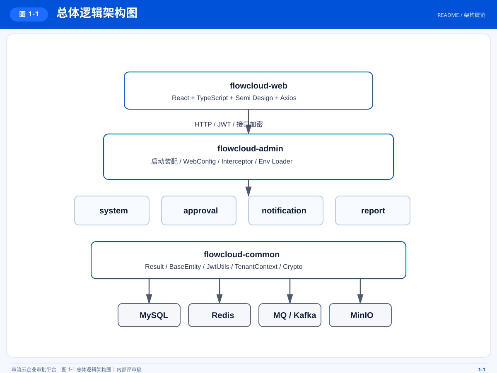
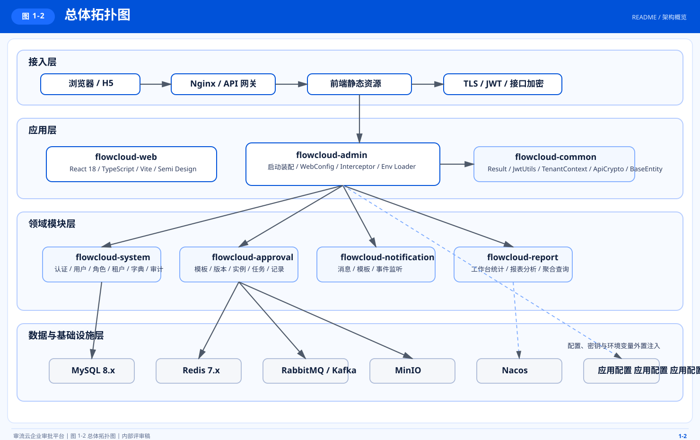
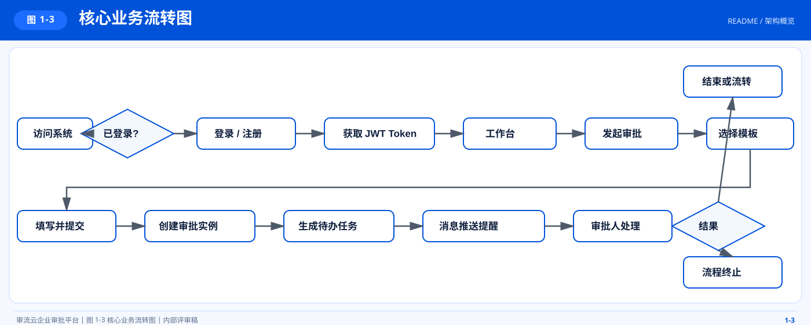
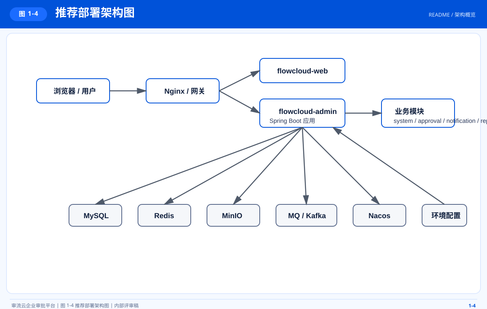
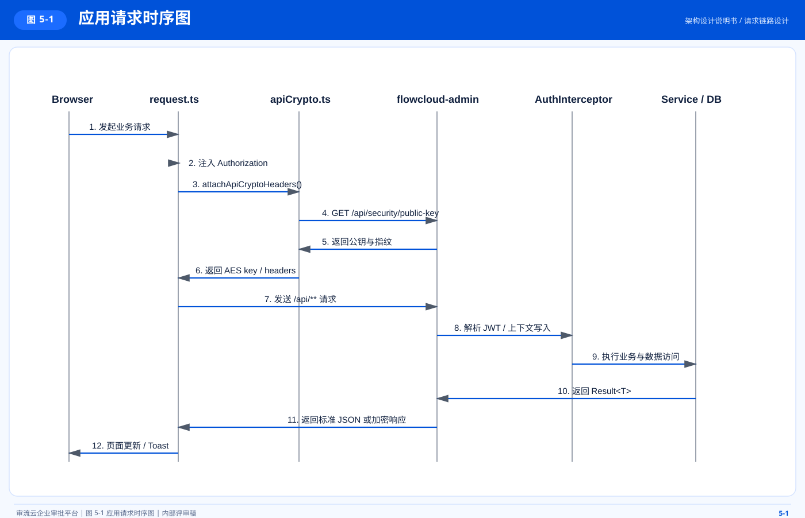
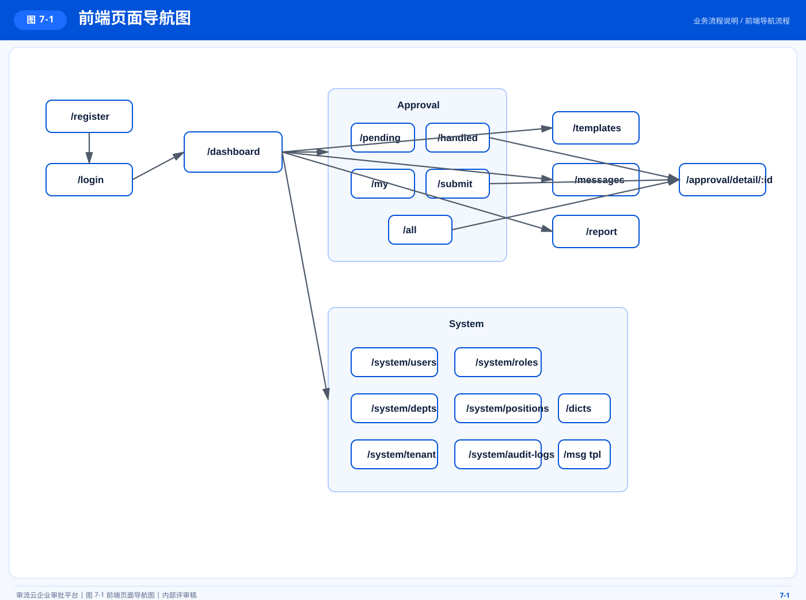

# <div align="center">审流云 FlowCloud Enterprise SaaS Platform</div>

<div align="center">
  
</div>

<div align="center">


</div>

## 项目简介

审流云是一套面向企业审批与组织协同场景的 SaaS 平台，覆盖租户管理、组织权限、流程审批、消息通知、统计分析等核心能力。项目采用模块化单体架构，后端以 `flowcloud-admin` 统一装配启动，前端采用独立管理台工程，兼顾当前交付效率与后续服务化演进空间。

当前仓库为前后端同仓工程，适用于企业内部审批系统、组织协同平台、中后台 SaaS 管理系统等业务场景。

## 产品能力

- 多租户能力：支持租户注册、租户资料维护、租户级功能控制与数据隔离
- 组织权限能力：覆盖用户、角色、权限、部门、岗位、数据字典、审计日志
- 审批流程能力：支持模板管理、模板发布、审批发起、待办处理、已办查询、审批详情
- 消息通知能力：支持站内消息、未读统计、消息模板管理
- 统计分析能力：提供工作台统计与审批分析能力
- 安全治理能力：内置 JWT、RBAC、接口加密、统一异常处理、统一结果封装

## 技术栈

### 后端技术栈

| 技术 | 版本 | 说明 |
| --- | --- | --- |
| JDK | `21` | 项目编译与运行基线 |
| Spring Boot | `3.3.5` | 后端应用框架 |
| MyBatis-Flex | `1.9.7` | ORM 与多租户字段支持 |
| JJWT | `0.12.6` | JWT 鉴权实现 |
| SpringDoc | `2.6.0` | OpenAPI / Swagger 文档 |
| Hutool | `5.8.32` | 常用工具库 |
| EasyExcel | `4.0.3` | Excel 导入导出 |
| Lombok | `1.18.34` | Java 样板代码简化 |
| MySQL | `8.x` | 核心业务数据库 |
| Redis | `7.x` | 缓存与会话支撑 |
| Flyway | `Enabled` | 数据库迁移管理 |

### 前端技术栈

| 技术 | 版本 | 说明 |
| --- | --- | --- |
| React | `18.3.1` | 前端 UI 框架 |
| TypeScript | `5.6.2` | 类型系统 |
| Vite | `6.0.3` | 前端构建工具 |
| Semi Design | `2.70.0` | 企业级组件库 |
| Redux Toolkit | `2.5.0` | 全局状态管理 |
| React Router | `6.28.0` | 路由管理 |
| Axios | `1.7.9` | HTTP 请求封装 |
| ECharts | `5.5.1` | 图表展示 |
| Sass | `1.100.0` | 样式预处理 |

### 可选集成能力

以下能力已在配置层预留接入能力，可按部署环境启用：

- RabbitMQ
- Kafka
- MinIO
- Nacos

## 架构概览

### 架构形态

项目采用模块化单体架构，各业务能力按领域拆分为独立 Maven 模块，通过 `flowcloud-admin` 统一对外提供 HTTP 服务。公共能力集中在 `flowcloud-common`，业务模块保持边界清晰，适合中后台业务长期维护与稳态迭代。

### 图 1-1 总体逻辑架构图

用于说明平台在模块化单体架构下的核心分层、模块边界与公共能力沉淀关系。



源文件：`docs/images/readme-architecture.svg`

### 图 1-2 总体拓扑图

用于说明从接入层、应用层、领域层到数据与基础设施层的整体落位关系。



源文件：`docs/images/arch-topology.svg`

### 图 1-3 核心业务流转图

用于说明从用户访问、审批发起、任务流转到消息通知与结果回写的核心业务闭环。



源文件：`docs/images/readme-system-flow.svg`

### 图 1-4 推荐部署架构图

用于说明开发与生产环境下前端、后端、配置中心及基础设施组件的推荐部署基线。



源文件：`docs/images/readme-deployment.svg`

### 设计原则

- 单一入口：统一由 `flowcloud-admin` 负责应用启动、配置装配、拦截器注册
- 公共下沉：认证、异常、返回模型、接口加密、租户上下文统一沉淀到 `flowcloud-common`
- 领域拆分：系统、审批、通知、报表按业务域拆分，降低模块耦合
- 配置外置：运行配置由 `application.yml` 与 `application.env` 统一管理
- 安全前置：默认包含 JWT、RBAC、接口加密链路与审计能力

## 模块说明

```text
EnterpriseSaaSPlatform/
├── flowcloud-admin/          # 启动入口、Web 配置、环境变量加载
├── flowcloud-common/         # 统一返回、异常、JWT、接口加密、租户上下文
├── flowcloud-system/         # 认证、用户、角色、权限、部门、岗位、租户、审计
├── flowcloud-approval/       # 审批模板、审批实例、审批任务、附件
├── flowcloud-notification/   # 站内消息、消息模板
├── flowcloud-report/         # 工作台与审批分析
├── flowcloud-web/            # React 管理台工程
├── sql/                      # 建表与初始化数据
├── docs/                     # 架构与专题文档
└── 脚本/                     # 辅助脚本
```

## 业务范围

### 系统管理

- 认证注册：`/api/auth`
- 用户管理：`/api/system/users`
- 角色管理：`/api/system/roles`
- 部门管理：`/api/system/depts`
- 岗位管理：`/api/system/positions`
- 权限管理：`/api/system/permissions`
- 字典管理：`/api/system/dicts`
- 租户中心：`/api/system/tenant`
- 审计日志：`/api/system/audit-logs`

### 审批中心

- 模板管理：`/api/approval/templates`
- 实例管理：`/api/approval/instances`
- 任务处理：`/api/approval/tasks`
- 附件管理：`/api/attachments`

### 通知中心

- 站内消息：`/api/messages`
- 消息模板：`/api/system/message-templates`

### 报表中心

- 工作台：`/api/report/dashboard`
- 审批分析：`/api/report/analytics`

## 交互设计图

### 接口调用时序图



源文件：`docs/images/readme-sequence.svg`

### 前端页面导航图



源文件：`docs/images/readme-navigation.svg`

## 核心约定

### 统一响应

后端统一返回对象为 `Result<T>`，标准结构如下：

```json
{
  "code": 200,
  "message": "success",
  "data": {},
  "timestamp": 1717660800000
}
```

### 多租户隔离

- 业务数据通过 `tenant_id` 进行租户隔离
- 鉴权成功后由上下文保存当前租户信息
- 查询与写入逻辑必须遵守当前租户边界
- 禁止跨租户直接读取或修改业务数据

### 安全机制

- JWT 鉴权与用户上下文注入
- RBAC 权限模型
- 请求与响应统一接口加密
- 全局异常处理与统一错误返回

## 数据模型

### 核心实体关系图


源文件：`docs/images/core-entity-er.svg`

### 核心表说明

| 领域 | 核心表 |
| --- | --- |
| 租户与组织 | `sys_tenant`、`sys_dept`、`sys_user`、`sys_position` |
| 权限体系 | `sys_role`、`sys_permission`、`sys_user_role`、`sys_role_permission` |
| 审批流程 | `approval_template`、`approval_template_version`、`approval_instance`、`approval_task`、`approval_record` |
| 通知与审计 | `sys_message`、`sys_message_template`、`sys_audit_log` |
| 字典能力 | `sys_dict_type`、`sys_dict_data` |

## 数据初始化

### SQL 文件

- 建表脚本：`sql/schema.sql`
- 初始化数据：`sql/data.sql`
- 测试补充数据：`sql/test-supplement-data.sql`

### 默认账号

初始化数据默认密码均为 `123456`。

| 租户编码 | 用户名 | 角色 |
| --- | --- | --- |
| `demo` | `admin` | 管理员 |
| `demo` | `manager` | 审批人 |
| `demo` | `zhangsan` | 普通员工 |
| `acme` | `admin` | 管理员 |

登录参数由 `tenantCode + username + password` 组成。

## 环境要求

- JDK `21+`
- Maven `3.8+`
- Node.js `18+`
- MySQL `8.x`
- Redis `7.x`

按实际部署需要可接入 RabbitMQ、Kafka、MinIO、Nacos。

## 配置说明

### 配置优先级

1. 操作系统环境变量
2. 项目根目录 `application.env`
3. 项目根目录 `.env`
4. `application.yml` 默认值

### 最小配置项

```env
SPRING_DATASOURCE_URL=jdbc:mysql://localhost:3306/flowcloud?useUnicode=true&characterEncoding=UTF-8&connectionCollation=utf8mb4_unicode_ci&serverTimezone=Asia/Shanghai&useSSL=false&allowPublicKeyRetrieval=true
SPRING_DATASOURCE_USERNAME=root
SPRING_DATASOURCE_PASSWORD=root

SPRING_DATA_REDIS_HOST=localhost
SPRING_DATA_REDIS_PORT=6379
SPRING_DATA_REDIS_PASSWORD=redis123

FLOWCLOUD_JWT_SECRET=请替换为生产随机密钥
FLOWCLOUD_API_CRYPTO_PRIVATE_KEY_LOCATION=file:/your-path/private-key.pem
FLOWCLOUD_API_CRYPTO_PUBLIC_KEY_LOCATION=file:/your-path/public-key.pem
```

推荐直接维护项目根目录 `application.env`，敏感信息不得提交到仓库。

## 快速启动

### 1. 初始化数据库

```bash
mysql -u root -p < sql/schema.sql
mysql -u root -p < sql/data.sql
```

### 2. 生成接口加密密钥

```powershell
powershell -ExecutionPolicy Bypass -File .\脚本\生成接口加密密钥.ps1
```

### 3. 启动后端

```bash
mvn clean package -DskipTests
mvn -pl flowcloud-admin spring-boot:run
```

### 4. 启动前端

```bash
cd flowcloud-web
npm install
npm run dev
```

## 默认访问地址

- 前端开发服务：`http://localhost:5173`
- 后端服务：`http://localhost:8080`
- Swagger 文档：`http://localhost:8080/swagger-ui.html`
- 接口加密公钥：`http://localhost:8080/api/security/public-key`

## 联调检查清单

- 数据库已创建并执行 `schema.sql` 与 `data.sql`
- Redis 已启动且连接配置正确
- `application.env` 已正确配置
- RSA 公钥与私钥文件已生成并可访问
- 本机 Maven 与 Node.js 环境可用
- 前后端端口未被其他进程占用

## 目录文档

- 架构设计说明书：`docs/architecture.md`
- 业务流程说明：`docs/business-process.md`
- 数据库设计说明：`docs/database-design.md`
- 权限模型说明：`docs/permission-model.md`
- API 审计报告：`docs/api-audit-report.md`
- Logo 资源：`docs/images/logo.png`

## 安全要求

- 生产环境必须替换默认 JWT 密钥
- 生产环境所有实例必须共享同一套接口加密私钥
- 密钥、密码、令牌、环境配置不得提交至代码仓库
- 修改 `application.env` 后必须重启后端应用

## 适用场景

- 企业审批系统
- 组织协同平台
- 中后台 SaaS 管理系统
- 多租户工作流与通知中心场景
