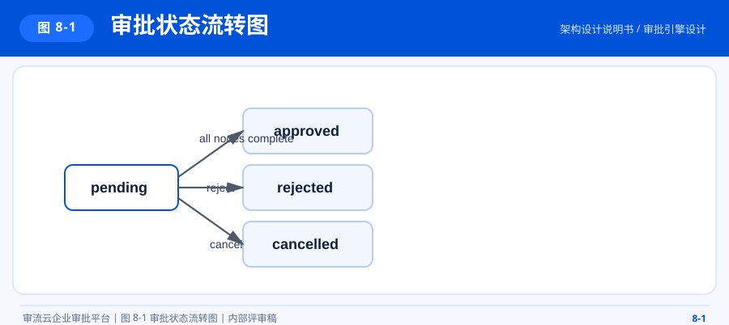

# 审流云架构设计说明书

## 1. 文档概述

### 1.1 文档目标

本文档用于描述审流云企业审批平台的总体架构、模块边界、技术选型、部署基线、安全设计与演进方向，作为研发、测试、部署、运维与后续扩展的统一架构依据。

### 1.2 项目定位

审流云是一套面向企业审批与组织协同场景的 SaaS 平台，当前覆盖以下核心业务域：

- 租户管理
- 用户与组织管理
- 角色与权限管理
- 审批模板与审批实例管理
- 站内消息与提醒
- 工作台与统计报表

### 1.3 架构结论

当前版本采用**模块化单体架构**。该架构在单仓、单应用启动的基础上，通过 Maven 多模块与清晰的领域边界控制复杂度，满足当前项目阶段对交付效率、可维护性和后续拆分能力的综合要求。

## 2. 设计原则

- 领域边界清晰：系统、审批、通知、报表按业务域拆分
- 启动入口统一：由 `flowcloud-admin` 统一装配 Spring Boot 应用
- 公共能力下沉：通用模型、安全、异常、租户上下文统一收敛到 `flowcloud-common`
- 配置外置管理：环境变量优先，支持 `application.env` 与系统环境变量覆盖
- 安全默认启用：JWT、RBAC、接口加密、审计能力默认纳入架构基线
- 演进友好：当前保持单体，后续可按领域拆分服务

## 3. 总体架构

### 3.1 图 3-1 逻辑架构图

本图用于说明平台在模块化单体架构下的核心分层关系、模块边界与公共能力沉淀位置。


### 3.2 图 3-2 总体拓扑图

本图用于说明从接入层、应用层、领域模块层到数据与基础设施层的整体落位关系。


### 3.3 模块职责

| 模块 | 说明 |
| --- | --- |
| `flowcloud-admin` | 应用启动入口、Web 配置、拦截器、环境变量加载 |
| `flowcloud-common` | 统一返回、异常处理、JWT、接口加密、租户上下文、基础实体 |
| `flowcloud-system` | 认证注册、用户、角色、权限、部门、岗位、租户、字典、审计 |
| `flowcloud-approval` | 审批模板、版本快照、审批实例、审批任务、审批记录、附件 |
| `flowcloud-notification` | 站内消息、消息模板、审批事件监听 |
| `flowcloud-report` | 工作台统计、审批分析 |
| `flowcloud-web` | 前端管理台、路由控制、菜单权限、接口请求封装 |

### 3.4 目录结构

```text
EnterpriseSaaSPlatform/
├── flowcloud-admin/
├── flowcloud-common/
├── flowcloud-system/
├── flowcloud-approval/
├── flowcloud-notification/
├── flowcloud-report/
├── flowcloud-web/
├── sql/
└── docs/
```

## 4. 核心技术栈

### 4.1 后端

| 技术 | 版本 | 用途 |
| --- | --- | --- |
| JDK | `21` | 运行时与语言基线 |
| Spring Boot | `3.3.5` | 应用框架 |
| MyBatis-Flex | `1.9.7` | ORM、多租户、分页查询 |
| JJWT | `0.12.6` | Token 生成与校验 |
| SpringDoc | `2.6.0` | Swagger / OpenAPI |
| Hutool | `5.8.32` | 工具能力 |
| EasyExcel | `4.0.3` | 导入导出 |

### 4.2 前端

| 技术 | 版本 | 用途 |
| --- | --- | --- |
| React | `18.3.1` | 前端视图框架 |
| TypeScript | `5.6.2` | 类型系统 |
| Vite | `6.0.3` | 构建工具 |
| Semi Design | `2.70.0` | 企业级组件库 |
| Redux Toolkit | `2.5.0` | 状态管理 |
| React Router | `6.28.0` | 路由管理 |
| Axios | `1.7.9` | 请求封装 |

### 4.3 基础设施

- MySQL `8.x`
- Redis `7.x`
- RabbitMQ
- Kafka
- MinIO
- Nacos

说明：其中 RabbitMQ、Kafka、MinIO、Nacos 当前为预留或按环境启用能力，并非本地最小运行必选项。

## 5. 请求链路设计

### 5.1 图 5-1 应用请求时序图

本图用于说明前端请求从发起、鉴权、接口加密到后端处理与结果返回的完整链路。


### 5.2 标准处理链

1. 前端请求统一经 `request.ts` 发起
2. 请求头注入 JWT
3. 若启用接口加密，则先获取公钥并生成 AES 会话密钥
4. 后端拦截器解析当前用户与租户上下文
5. Controller 接收参数，Service 执行业务逻辑
6. 统一返回 `Result<T>`
7. 前端统一处理 `code`、`message` 与异常提示

## 6. 多租户架构

### 6.1 隔离策略

- 数据库隔离方式：共享数据库、共享表，通过 `tenant_id` 隔离业务数据
- 上下文隔离方式：请求进入后将 `tenantId`、`userId` 写入 `TenantContext`
- 能力隔离方式：租户级功能开关控制审批、报表、消息、租户配置等模块能力

### 6.2 租户初始化

租户注册完成后，系统自动初始化以下基础数据：

- 根部门
- 管理员角色
- 审批人角色
- 普通员工角色
- 企业管理员账号

### 6.3 功能开关

当前内置功能键如下：

- `approval`
- `report`
- `message`
- `tenantSettings`

当租户未开通对应功能时，前端菜单与后端接口均受限。

## 7. 权限架构

### 7.1 图 7-1 权限模型图

系统采用 `用户 -> 角色 -> 权限` 的经典 RBAC 模型，并叠加管理员直通权限与数据范围控制。


### 7.2 数据范围

- `ALL`：全量数据
- `DEPT`：本部门数据
- `SELF`：仅本人数据

### 7.3 管理员机制

- `is_admin = 1` 的用户自动拥有 `admin` 角色语义
- 管理员自动获得通配权限 `*`
- 管理员默认具备全部数据范围

## 8. 审批引擎设计

### 8.1 核心对象

- 模板：`approval_template`
- 模板版本：`approval_template_version`
- 审批实例：`approval_instance`
- 审批任务：`approval_task`
- 审批记录：`approval_record`

### 8.2 流程规则

- 流程节点配置保存在模板 `flow_config`
- 提交时将流程快照固化到实例 `flow_config_snapshot`
- 节点审批人支持按用户、角色、直属上级、部门负责人解析
- 节点模式支持顺序/会签与或签

### 8.3 图 8-1 审批状态流转图

本图用于说明审批实例从提交、审批中、通过、驳回到撤销等关键状态的流转关系。



## 9. 消息与事件设计

### 9.1 事件来源

- 审批任务分配
- 审批通过
- 审批驳回
- 审批取消
- 审批催办

### 9.2 消息策略

- 业务侧发布 `ApprovalEvent`
- 通知模块监听事件并生成站内消息
- 可按环境启用 MQ 做异步削峰与解耦

## 10. 部署架构

### 10.1 图 10-1 推荐部署图

本图用于说明前端、后端、数据库、缓存及可选基础设施组件的推荐部署基线。


### 10.2 本地开发基线

- 前端：Vite 开发服务
- 后端：`mvn -pl flowcloud-admin spring-boot:run`
- 数据库：MySQL
- 缓存：Redis

### 10.3 生产建议

- 前端静态资源由 Nginx 托管
- 后端以 Jar 或容器形式部署
- 配置、密钥与凭证外置
- 接口加密私钥多实例共享
- 统一反向代理与访问日志收口

## 11. 安全设计

### 11.1 鉴权安全

- JWT 作为访问凭证
- 未登录请求统一拒绝
- 权限不足返回统一错误码

### 11.2 数据安全

- 请求与响应支持接口加密
- 敏感配置通过环境变量注入
- 数据库、Redis、对象存储建议使用独立账号

### 11.3 审计能力

- 登录、审批、催办、驳回等关键动作发布审计事件
- 审计数据统一写入 `sys_audit_log`

## 12. 可用性与扩展性

### 12.1 当前优势

- 模块边界清晰，便于协同开发
- 单体交付简单，适合中后台项目稳态迭代
- 多租户、RBAC、审批流具备完整业务闭环

### 12.2 演进方向

- 审批、通知、报表按域拆分独立服务
- 接入配置中心与服务注册中心
- 引入对象存储统一附件管理
- 引入 MQ 异步处理通知与审计
- 强化报表聚合与数据导出能力

## 13. 风险与边界

- 当前为模块化单体，极端高并发下需进一步拆分与异步化
- 多租户采用共享表模式，对 SQL 规范与租户字段约束要求较高
- 接口加密依赖前端 Web Crypto 环境与统一密钥管理

## 14. 关联文档

- `README.md`
- `docs/business-process.md`
- `docs/database-design.md`
- `docs/permission-model.md`
- `docs/api-audit-report.md`
