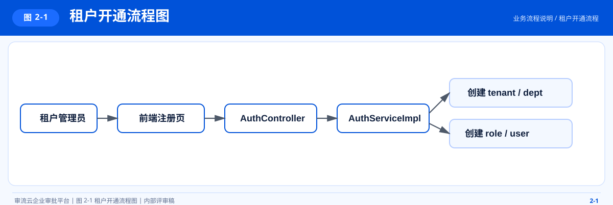
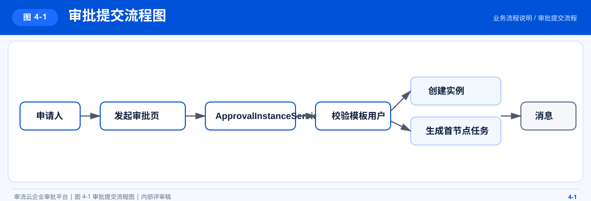
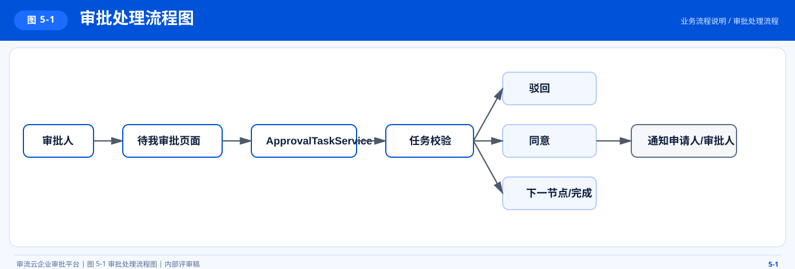
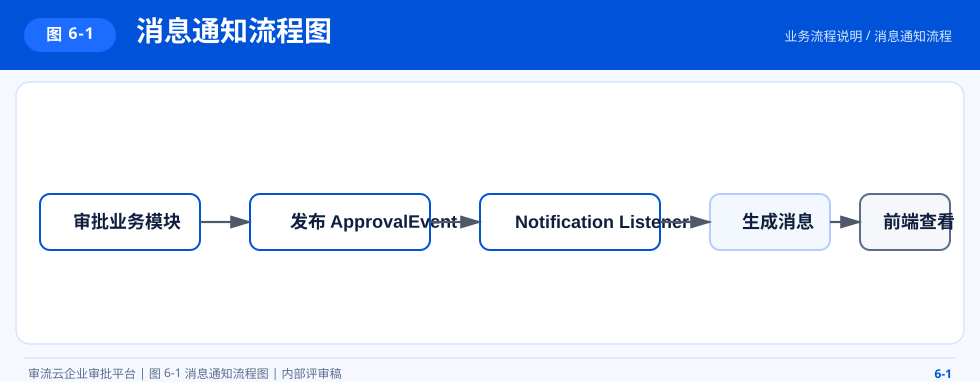

# 审流云业务流程说明

## 1. 文档目的

本文档用于说明审流云当前版本的关键业务流程，包括租户注册、登录鉴权、审批提交流转、审批处理与消息通知链路，帮助产品、研发、测试和实施团队快速理解系统主流程。

## 2. 租户开通流程

### 2.1 流程说明

新租户通过注册页提交企业信息后，系统自动创建租户、根部门、默认角色和管理员账号，形成可直接登录的最小组织结构。

### 2.2 图 2-1 租户开通流程图

本图用于说明租户从注册提交、系统初始化到管理员账号创建完成的全链路处理过程。

### 2.3 关键结果

- 初始化租户基本信息
- 默认创建管理员、审批人、普通员工三类角色
- 创建企业管理员账号并绑定管理员角色
- 初始化租户功能开关与基础套餐信息

## 3. 登录鉴权流程

### 3.1 流程说明

登录使用 `tenantCode + username + password` 三元组完成租户身份与用户身份双重校验，登录成功后返回 JWT、角色、权限和功能开通信息。

### 3.2 图 3-1 登录鉴权流程图

本图用于说明登录过程中的租户校验、用户认证、权限装载与令牌返回路径。

### 3.3 登录结果

- 返回 JWT Token
- 返回当前用户基本信息
- 返回角色集合
- 返回权限编码集合
- 返回当前租户开通功能列表
- 返回数据范围信息

## 4. 审批提交流程

### 4.1 流程说明

用户发起审批时，系统根据模板与流程配置生成审批实例、首节点任务和提交记录，并向审批人发送待办消息。

### 4.2 图 4-1 审批提交流程图

本图用于说明审批提交时模板校验、实例创建、任务生成与待办通知的处理顺序。

### 4.3 关键规则

- 模板不存在时禁止提交
- 流程节点为空时禁止提交
- 流程快照在提交时固化到实例，避免后续模板修改影响历史单据
- 节点审批人支持指定用户、角色、直属上级、部门负责人

## 5. 审批处理流程

### 5.1 流程说明

审批人仅能处理分配给自己的待办任务。处理结果分为同意与驳回两类，不同节点模式决定实例是否推进到下一节点。

### 5.2 图 5-1 审批处理流程图

本图用于说明审批人处理待办任务后，流程推进、关闭或终止的判定逻辑。

### 5.3 节点模式

- `or-sign`：任意一名审批人同意即可推进，其他同节点待办自动关闭
- 默认模式：要求当前节点全部待办处理完成后才能推进

## 6. 消息通知流程

### 6.1 流程说明

系统通过业务事件驱动消息生成，当前以站内消息为主，后续可扩展为短信、邮件、企业微信等通道。

### 6.2 图 6-1 消息通知流程图

本图用于说明审批相关业务事件如何驱动站内消息生成、分发与结果提醒。

### 6.3 触发场景

- 分配待办
- 审批通过
- 审批驳回
- 审批取消
- 审批催办

## 7. 前端导航流程

### 7.1 图 7-1 前端页面导航图

本图用于说明登录后主要页面入口、审批中心导航结构与系统管理页面组织方式。

### 7.2 导航控制原则

- 未登录用户只能访问登录页与注册页
- 已登录用户进入 `MainLayout`
- 菜单显示受角色权限与租户功能开关双重控制
- 无权限页面自动跳转到首个可访问页面

## 8. 关键业务状态

### 8.1 审批实例状态

- `pending`
- `approved`
- `rejected`
- `cancelled`

### 8.2 审批任务状态

- `pending`
- `approved`
- `rejected`

## 9. 异常与边界处理

- 租户不存在时拒绝登录
- 租户禁用或过期时拒绝登录
- 用户状态异常时拒绝登录
- 非任务负责人不可处理审批
- 非申请人不可撤销自己的审批单以外的单据
- 未开通功能的租户不可访问对应页面与接口

## 10. 关联文档

- `docs/architecture.md`
- `docs/database-design.md`
- `docs/permission-model.md`
