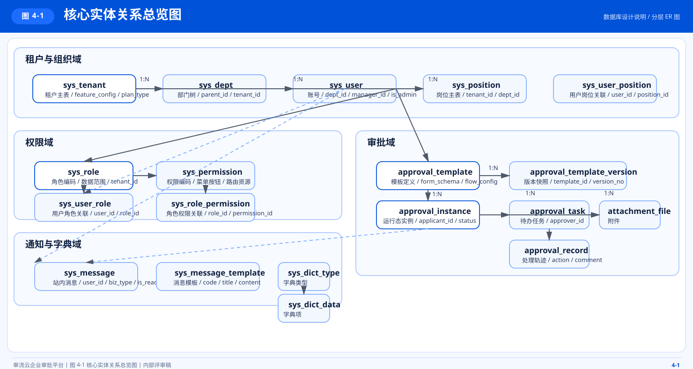
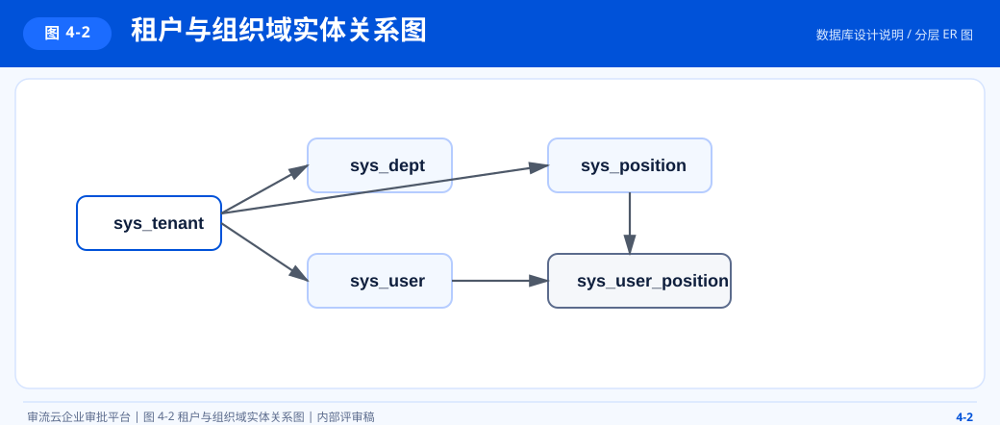
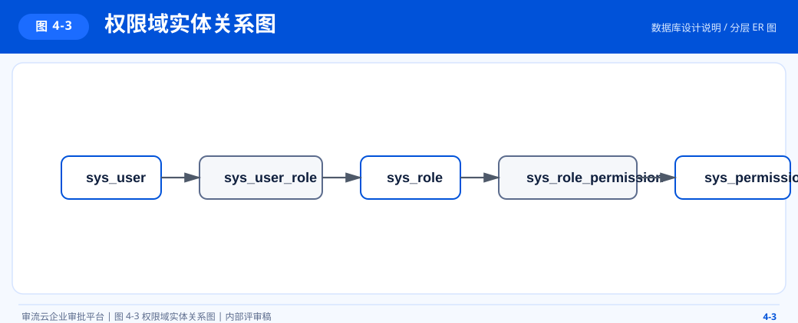
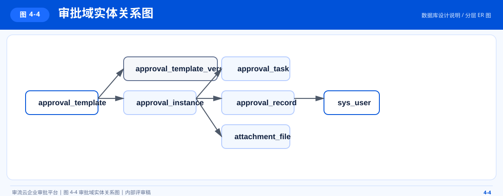
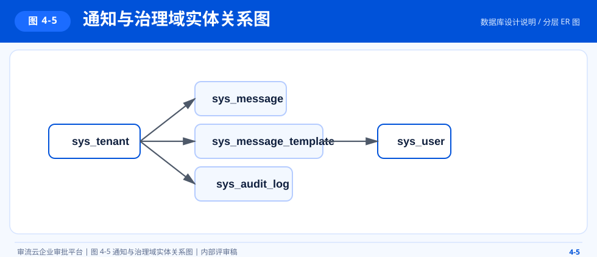

# 审流云数据库设计说明

## 1. 文档概述

本文档用于说明审流云当前数据库设计、核心实体关系、分层建模思路与主要表职责，供后端研发、测试、DBA 与实施人员使用。

## 2. 设计原则

- 主业务数据统一使用 MySQL 持久化
- 多租户业务表统一以 `tenant_id` 作为逻辑隔离键
- 主体表优先按业务域拆分，避免超大宽表
- 审批模板与审批实例分离，运行态采用快照保证历史一致性
- 关联关系优先显式建模，使用中间表承载多对多关系

## 3. 数据域划分

| 数据域 | 说明 | 核心表 |
| --- | --- | --- |
| 租户与组织域 | 企业、部门、岗位、用户 | `sys_tenant`、`sys_dept`、`sys_position`、`sys_user`、`sys_user_position` |
| 权限域 | 角色、权限、角色授权、用户角色 | `sys_role`、`sys_permission`、`sys_user_role`、`sys_role_permission` |
| 审批域 | 模板、实例、任务、记录、附件、版本 | `approval_template`、`approval_template_version`、`approval_instance`、`approval_task`、`approval_record`、`attachment_file` |
| 通知与审计域 | 消息、消息模板、审计日志 | `sys_message`、`sys_message_template`、`sys_audit_log` |
| 字典域 | 字典类型与数据项 | `sys_dict_type`、`sys_dict_data` |

## 4. 分层 ER 图

### 4.1 图 4-1 核心实体关系总览图

本图用于说明租户组织、权限、审批、通知与字典等核心数据域之间的主干关联关系。

### 4.2 图 4-2 租户与组织域实体关系图

本图用于说明租户、部门、用户、岗位及用户岗位关联的组织主线建模关系。

### 4.3 图 4-3 权限域实体关系图

本图用于说明角色、权限、用户角色与角色权限关联表之间的授权关系。

### 4.4 图 4-4 审批域实体关系图

本图用于说明审批模板、版本、实例、任务、记录与附件之间的运行态关系。

### 4.5 图 4-5 通知与治理域实体关系图

本图用于说明站内消息、消息模板、审计日志及辅助治理数据的结构关系。

## 5. 核心表说明

### 5.1 `sys_tenant`

用途：租户主表，用于承载企业主体信息、套餐信息、功能开关与品牌信息。

关键字段：

- `tenant_code`：租户编码，全局唯一
- `tenant_name`：租户名称
- `status`：租户状态
- `plan_type`：套餐类型
- `max_users`：最大用户数
- `expire_time`：套餐到期时间
- `feature_config`：租户功能开关 JSON

### 5.2 `sys_user`

用途：用户主表，存储账号、身份、组织归属与状态信息。

关键字段：

- `tenant_id`：所属租户
- `username`：用户名，租户内唯一
- `password`：加密密码
- `dept_id`：所属部门
- `manager_id`：直属上级
- `is_admin`：是否管理员

### 5.3 `sys_role` 与 `sys_permission`

用途：构建角色权限模型。

关键字段：

- `role_code`：角色编码
- `data_scope`：数据范围
- `perm_code`：权限编码
- `perm_type`：权限类型，当前用于区分菜单与按钮

### 5.4 `approval_template`

用途：审批模板定义表，用于承载流程配置和表单定义。

关键字段：

- `template_code`：模板编码
- `template_name`：模板名称
- `category`：模板分类
- `form_schema`：表单结构 JSON
- `flow_config`：流程配置 JSON
- `pub_version`：已发布版本号

### 5.5 `approval_instance`

用途：审批运行态主表，记录具体审批单。

关键字段：

- `instance_no`：审批单号
- `template_id`：来源模板
- `applicant_id`：申请人
- `form_data`：提交表单数据
- `flow_config_snapshot`：提交流程快照
- `status`：审批状态
- `current_node`：当前节点索引

### 5.6 `approval_task`

用途：审批待办任务表，记录当前节点分配给具体审批人的处理任务。

关键字段：

- `instance_id`：所属审批实例
- `node_index`：节点索引
- `approver_id`：审批人
- `status`：任务状态
- `handle_time`：处理时间

### 5.7 `approval_record`

用途：审批轨迹表，记录提交、通过、驳回等完整处理历史。

关键字段：

- `instance_id`：审批实例 ID
- `node_name`：节点名称
- `operator_id`：操作人
- `action`：动作类型
- `comment`：处理意见

### 5.8 `sys_message`

用途：站内消息中心表，承载待办、提醒、结果通知等信息。

关键字段：

- `user_id`：接收人
- `type`：消息类型
- `biz_type`：业务类型
- `biz_id`：业务主键
- `is_read`：是否已读

## 6. 表关系说明

### 6.1 租户主线

- 一个租户可以拥有多个部门
- 一个租户可以拥有多个用户
- 一个租户可以拥有多个角色
- 一个租户可以拥有多个审批模板和审批实例

### 6.2 权限主线

- 用户与角色是多对多关系，通过 `sys_user_role` 建模
- 角色与权限是多对多关系，通过 `sys_role_permission` 建模
- 管理员通过 `is_admin` 获得平台级通配权限

### 6.3 审批主线

- 一个模板可以派生多个审批实例
- 一个实例可以生成多个审批任务
- 一个实例可以产生多条审批记录
- 一个实例可以关联多个附件

## 7. 状态设计

### 7.1 审批实例状态

| 状态值 | 说明 |
| --- | --- |
| `pending` | 审批中 |
| `approved` | 已通过 |
| `rejected` | 已驳回 |
| `cancelled` | 已撤销 |

### 7.2 审批任务状态

| 状态值 | 说明 |
| --- | --- |
| `pending` | 待处理 |
| `approved` | 已同意 |
| `rejected` | 已驳回或已关闭 |

## 8. 索引与约束

当前设计中已体现的关键约束包括：

- `sys_tenant.tenant_code` 唯一
- `sys_user` 按 `(tenant_id, username)` 唯一
- `sys_user_role` 按 `(user_id, role_id)` 唯一
- `sys_role_permission` 按 `(role_id, permission_id)` 唯一
- `approval_instance.instance_no` 全局唯一
- 业务表对常用筛选条件均配置基础索引

## 9. 设计取舍

### 9.1 为什么模板与实例分离

- 模板是定义态
- 实例是运行态
- 实例中固化 `flow_config_snapshot`，可避免模板更新污染历史审批

### 9.2 为什么采用共享表多租户

- 部署简单，适合当前阶段
- 成本较低，便于中小规模 SaaS 快速迭代
- 后续可根据租户规模演进为分库分表或独立实例

### 9.3 为什么附件独立建表

- 附件数量与业务记录解耦
- 便于对象存储演进
- 支持模板与实例两类附件挂载

## 10. 后续优化建议

- 统一显式外键约束策略与删除策略
- 对大表增加归档策略
- 对报表查询引入汇总表或宽表
- 对消息与审计场景引入异步写入
- 对高频审批查询建立组合索引与缓存

## 11. 关联文档

- `docs/architecture.md`
- `docs/business-process.md`
- `docs/permission-model.md`
