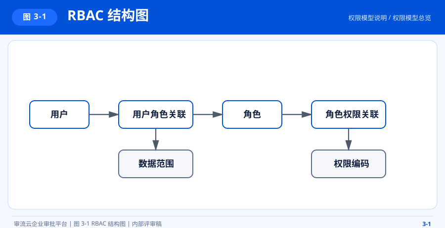
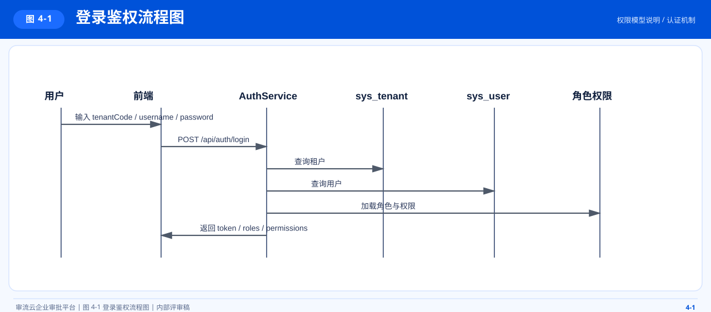
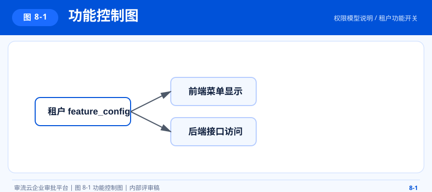
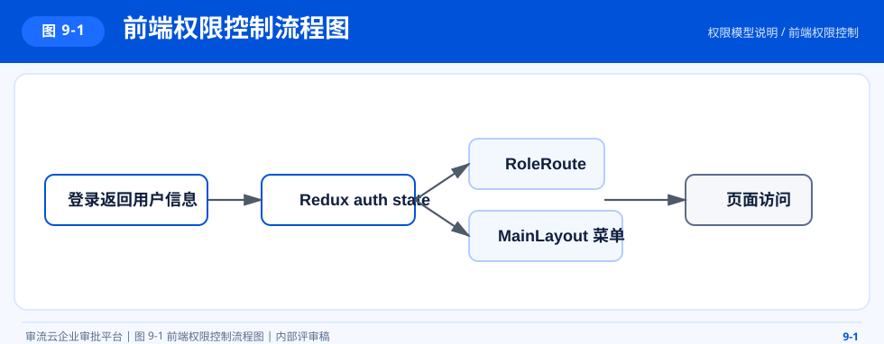
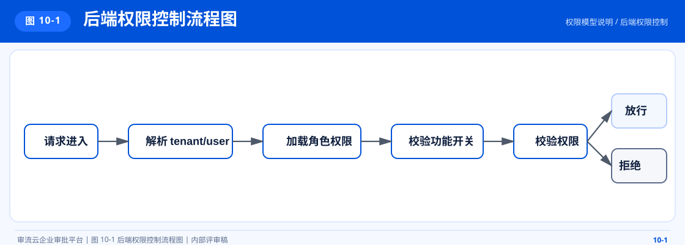

# 审流云权限模型说明

## 1. 文档概述

本文档说明审流云当前版本的权限体系设计，包括认证机制、RBAC 模型、数据范围、租户功能开关与前后端协同控制方式。

## 2. 权限设计目标

- 支持租户内多角色授权
- 支持菜单与按钮级权限编码
- 支持管理员全量权限
- 支持数据范围控制
- 支持租户级功能开关控制
- 支持前后端双重校验

## 3. 权限模型总览

### 3.1 图 3-1 RBAC 结构图

本图用于说明用户、角色、权限及关联表在 RBAC 授权模型中的核心映射关系。

### 3.2 模型说明

- 用户与角色是多对多关系
- 角色与权限是多对多关系
- 数据范围绑定在角色上
- 租户功能开关独立于 RBAC，用于控制模块是否启用
- 管理员通过 `is_admin = 1` 获取通配权限 `*`

## 4. 认证机制

### 4.1 登录要素

登录依赖以下三个字段：

- `tenantCode`
- `username`
- `password`

### 4.2 登录成功返回

- `token`
- `roles`
- `permissions`
- `dataScope`
- `enabledFeatures`

### 4.3 图 4-1 登录鉴权流程图

本图用于说明登录请求从租户校验、用户认证到令牌签发与权限装载的处理过程。

## 5. 角色模型

### 5.1 默认角色

系统在租户注册时自动初始化以下角色：

| 角色编码 | 角色名称 | 数据范围 |
| --- | --- | --- |
| `admin` | 管理员 | `ALL` |
| `approver` | 审批人 | `DEPT` |
| `employee` | 普通员工 | `SELF` |

### 5.2 管理员特权

- 自动拥有角色语义 `admin`
- 自动拥有通配权限 `*`
- 默认拥有全部数据范围

## 6. 权限编码设计

### 6.1 核心权限编码

| 业务域 | 权限编码 |
| --- | --- |
| 工作台 | `dashboard` |
| 发起审批 | `approval:submit` |
| 我的申请 | `approval:my` |
| 待我审批 | `approval:pending` |
| 全部审批 | `approval:all` |
| 模板管理 | `template`、`approval:template:manage` |
| 任务处理 | `approval:task:handle` |
| 全量实例查看 | `approval:instance:viewAll` |
| 消息中心 | `messages` |
| 用户管理 | `system:user`、`system:user:view`、`system:user:edit` |
| 部门管理 | `system:dept`、`system:dept:view`、`system:dept:edit` |
| 租户中心 | `system:tenant`、`system:tenant:view`、`system:tenant:edit` |
| 角色管理 | `system:role`、`system:role:view`、`system:role:edit` |
| 岗位管理 | `system:position`、`system:position:edit` |
| 审计日志 | `system:audit`、`system:audit:view` |
| 系统字典 | `system:dict`、`system:dict:edit` |
| 报表分析 | `report` |
| 消息模板 | `system:message-template`、`system:message-template:edit` |

### 6.2 编码原则

- 菜单类权限采用业务域前缀
- 按钮或动作类权限采用 `资源:动作` 形式
- 同一业务域权限保持前缀一致
- 管理类权限与查看类权限显式区分

## 7. 数据范围模型

### 7.1 数据范围定义

| 数据范围 | 说明 |
| --- | --- |
| `ALL` | 可访问租户内全量数据 |
| `DEPT` | 可访问本部门范围数据 |
| `SELF` | 仅可访问本人数据 |

### 7.2 判定规则

- 若任一角色的数据范围为 `ALL`，则最终范围为 `ALL`
- 若无 `ALL`，但存在 `DEPT`，则最终范围为 `DEPT`
- 否则为 `SELF`

### 7.3 典型场景

- 管理员查看全部用户与全部审批
- 审批人查看本部门范围任务或管理数据
- 普通员工查看本人申请与个人相关数据

## 8. 租户功能开关

### 8.1 功能键

| 功能键 | 说明 |
| --- | --- |
| `approval` | 审批中心 |
| `report` | 报表分析 |
| `message` | 消息中心 |
| `tenantSettings` | 租户配置 |

### 8.2 图 8-1 功能控制图

本图用于说明租户功能开关如何同时影响前端菜单可见性与后端接口访问控制。

### 8.3 控制原则

- 前端通过 `enabledFeatures` 控制菜单与页面入口
- 后端通过请求路径映射控制接口访问
- 租户未开通功能时，前后端均不可访问对应能力

## 9. 前端权限控制

### 9.1 控制位置

- 路由访问控制
- 菜单可见性控制
- 页面功能按钮控制
- 功能开关控制

### 9.2 图 9-1 前端权限控制流程图

本图用于说明前端页面在登录态、功能开通状态与权限编码校验下的访问判定流程。

### 9.3 判定逻辑

- 若无用户信息，跳转登录页
- 若功能未开通，页面不可访问
- 若无权限编码，自动跳转到首个可访问页面
- 管理员或具备 `*` 权限者直接通过

## 10. 后端权限控制

### 10.1 控制点

- 登录态校验
- 当前用户角色加载
- 当前用户权限加载
- `requirePermission`
- `requireAnyPermission`
- `requireAdmin`
- `requireApprover`

### 10.2 图 10-1 后端权限控制流程图

本图用于说明后端接口在登录态、角色、权限与审批特有规则下的统一判定路径。

### 10.3 审批特有权限

- 审批详情允许申请人查看
- 审批详情允许被分配过任务的审批人查看
- 拥有 `approval:all` 或 `approval:instance:viewAll` 时可查看全量审批单
- 任务处理必须是任务所属审批人本人

## 11. 建议与规范

### 11.1 权限新增规范

- 新增页面必须新增对应菜单权限
- 新增按钮操作必须补充动作权限
- 前端与后端权限编码保持一致
- 权限命名应体现业务域与动作语义

### 11.2 数据安全建议

- 仅依赖前端控制是不安全的，后端必须兜底
- 管理员通配权限应受审计日志覆盖
- 数据范围查询应尽量下沉到服务或查询层统一处理

## 12. 关联文档

- `docs/architecture.md`
- `docs/business-process.md`
- `docs/database-design.md`
